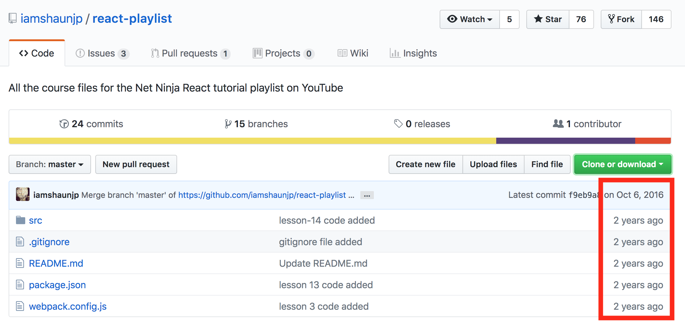

# react-playlist tutorial video 2 - Installing React (with Webpack)
https://www.youtube.com/watch?v=f7TmMBMLJ90&t=0s&list=PL4cUxeGkcC9i0_2FF-WhtRIfIJ1lXlTZR&index=4

Having a difficult time getting React and Webpack configured correctly by following this video tutorial closely, so I compiled the notes below to help others overcome the obstacles I encountered.

First, take a look at the author's 
[github repo](https://github.com/iamshaunjp/react-playlist)
last commit date - Oct 6, 2016.  Hmmm, a lot has changed since then.  

Step-by-step, here's how I got it to work:
1. git clone git@github.com:iamshaunjp/react-playlist.git
2. cd react-playlist
3. cp webpack.config.js  webpack.config.js.ORIG
> Here is where you have to start making changes:
First, you'll need to edit **webpack.config.js**
Change **loaders** to **rules**
Change **es2015** to **env** 

4. rm package.json - existing file has errors
5. npm init
6. npm install react react-dom --save
7. npm install babel-core babel-loader **babel-preset-es2015** babel-preset-react --save-dev
> npm WARN deprecated babel-preset-es2015@6.24.1: 🙌  Thanks for using Babel: we recommend using babel-preset-env now: please read babeljs.io/env to update!
https://babeljs.io/docs/en/env/
We're super 😸 excited that you're trying to use ES2015 syntax, but instead of continuing yearly presets, the team recommends using babel-preset-env. By default, it has the same behavior as previous presets to compile ES2015+ to ES5. 
So, **change babel-preset-es2015** to **babel-preset-env**
npm install babel-core babel-loader **babel-preset-env** babel-preset-react --save-dev

Now, continue on and install webpack.
8. npm install webpack webpack-dev-server --save-dev
9. Edit package.json in the scripts section add
“start”:”npm run build”,
“build”:”webpack -d && webpack-dev-server --content-base src/ —inline —hot --port 1234”
> when you run npm start, you'll get this:
WARNING in configuration
The 'mode' option has not been set, webpack will fallback to 'production' for this value. Set 'mode' option to 'development' or 'production' to enable defaults for each environment.
You can also set it to 'none' to disable any default behavior. Learn more: https://webpack.js.org/concepts/mode/
ℹ ｢wdm｣: Compiled with warnings.
This website explains it well --> https://www.valentinog.com/blog/webpack-tutorial/
In **package.json** add 
"scripts": {
  "dev": "webpack --mode development",
  "build": "webpack --mode production"
}
So, edit your **package.json start and build scripts** to look like this and the WARNING goes away:
    "build": "webpack -d && webpack-dev-server --content-base src/ --inline --hot --port 1234 **--mode production**",
    "dev": "webpack -d && webpack-dev-server --content-base src/ --inline --hot --port 1234 **--mode development**"

10. Edit index.js add alert(‘It works!!!’);
11. The video says to edit index.html - add  - but it's already there in the cloned repo.
12. **npm start** should work.  Let me know if you find any errors in this README.

# Lesson 4 - Components

After much research, I discovered React replaced createClass with createReactClass in version 16.
See this link at reactjs.org => https://reactjs.org/blog/2017/04/07/react-v15.5.0.html#migrating-from-reactcreateclass

You need to install the npm create react class package.  From the command line of your project's file path, 
you need to do **npm install create-react-class --save**, and then modify the code as follows:

add this line to index.js:  
 **var createReactClass = require('create-react-class');**

replace this line: var TodoComponent = React.createClass({
with this line: **var TodoComponent = createReactClass({**